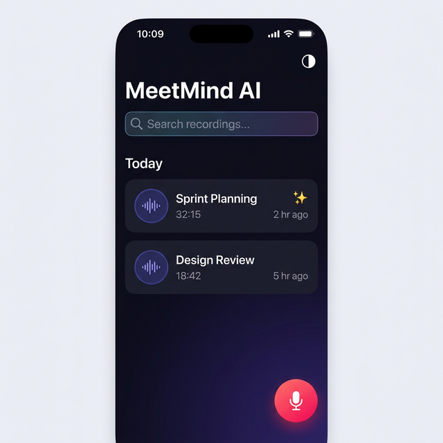
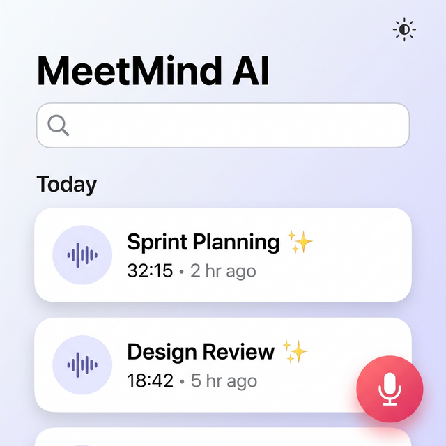
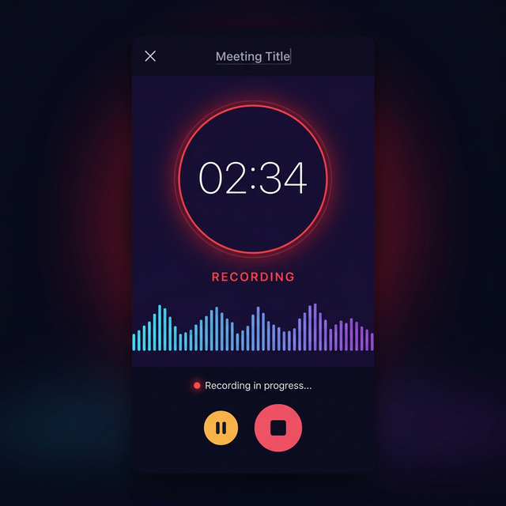
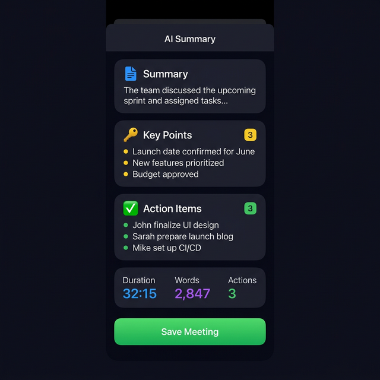
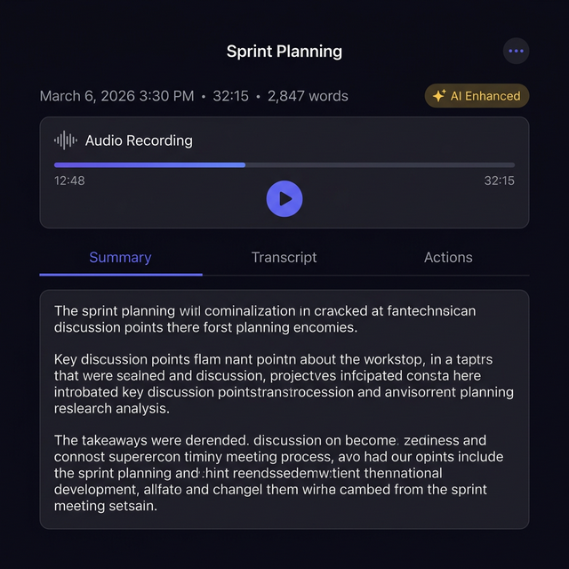
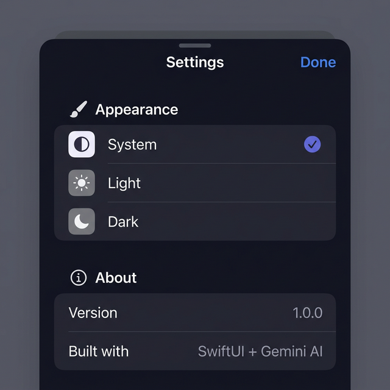

# 🧠 MeetMind AI

**AI-powered meeting recorder** that converts speech → text → AI summary → action items.

Built with **Swift + SwiftUI** using a clean **MVVM architecture** and **Google Gemini AI**.

---

## 📱 UI Showcase

### Home Screen (Dark & Light Mode)

| Dark Mode | Light Mode |
|---|---|
|  |  |

### App Flow

| Recording | AI Summary | Meeting Detail | Settings |
|---|---|---|---|
|  |  |  |  |

---

## 🛠 Tech Stack & Frameworks

| Component | Technology | Detail |
|---|---|---|
| **UI Framework** | SwiftUI | Fully declarative API, adaptive dark/light mode (`@AppStorage` + `@EnvironmentObject`). |
| **Architecture** | MVVM | Clean separation of UI (`Views`), state (`ViewModels`), and business logic (`Services`). |
| **Audio Capture** | `AVFoundation` | Uses `AVAudioRecorder` for tracking and capturing audio files (`.m4a`). |
| **Speech-to-Text** | `Speech` | Leverages Apple's on-device `SFSpeechRecognizer` for transcription. |
| **AI Integration** | REST + Combine | Direct integration with Google's Gemini API (`gemini-2.0-flash`) via `URLSession`. |
| **Persistence** | CoreData | Stores metadata, transcripts, and AI summaries cleanly with robust search predicates. |
| **Export** | `PDFKit` | Custom `UIGraphicsPDFRenderer` engine to render textual meeting notes. |
| **Concurrency** | Swift Concurrency | Modern `async`/`await` patterns used extensively with `Task` and `MainActor`. |

---

## 📂 Core Architecture: File-by-File Breakdown

### 1. 🏗 App & Models
- **`MeetMindApp.swift`**: The main entry point. Initializes dependencies (`CoreDataService.shared`, `ThemeManager.shared`) and injects them into the SwiftUI environment hierarchy. Applies the current `colorScheme`.
- **`Meeting.swift`**: Primary data model. Defines the structured `AISummaryResult` (summary, key points, actions, decisions) and utility properties (like formatted duration strings).

### 2. 🎛 Services (Backend & External Logic)
- **`OpenAIService.swift`**: The brain of the API connection. Constructs `URLRequest` to Google's Gemini API, injects a heavily-tuned **system prompt**, and executes an `async` JSON payload request. Contains a robust manual string parser `parseResponse` that guarantees structured data out of AI textual outputs.
- **`AudioRecorderService.swift`**: Interfaces directly with the hardware microphone. Handles creation of unique `.m4a` files in `documentDirectory`. Features a high-frequency `Timer (0.05s)` calculating the `averagePower` to pipe live waveform metrics out to the UI.
- **`SpeechRecognitionService.swift`**: Feeds the saved audio file into `SFSpeechURLRecognitionRequest`. Emits live UI updates as words are processed, recognizing speech iteratively.
- **`CoreDataService.swift`**: Singleton managing `NSPersistentContainer`. Implements CRUD operations (Create, Read, Update, Delete) and search operations leveraging `NSPredicate` built to scan transcripts, summaries, and action items concurrently.
- **`Secrets.swift`**: The protected vault. **(Gitignored)**. Exposes `Secrets.geminiAPIKey` to prevent hardcoded credentials on GitHub.

### 3. 🧠 ViewModels (State Controllers)
- **`MeetingViewModel.swift`**: Feeds `HomeView`. Fetches lists of meetings directly from CoreData. Subscribes to `$searchText` utilizing Combine's `.debounce` and `.removeDuplicates` to execute performant search filtering. Applies logical visual grouping built into dictionaries ("Today", "Yesterday").
- **`RecorderViewModel.swift`**: Holds state logic (`.idle`, `.recording`, `.paused`) and channels live waveform data from `AudioRecorderService` allowing seamless UI reactivity in the `RecordView`.
- **`AIViewModel.swift`**: Coordinates the entire transcription pipeline. Chaining `SpeechRecognitionService` immediately to `OpenAIService`. Creates and formats the final `Meeting` object saved to CoreData.

### 4. 🎨 Views (The User Interface)
- **`HomeView.swift`**: Displays customized components (meeting cards with dynamic accent colors), a floating action button (FAB), and a modal `.sheet` for system settings.
- **`RecordView.swift`**: A fully custom, immersive view forced into `.dark` mode (`preferredColorScheme(.dark)`). It features a pulsing red recording timer and a live multi-column audio waveform visualization.
- **`TranscriptView.swift` & `SummaryView.swift`**: Dedicated workflow views analyzing post-meeting stages via real-time loading UI, dynamic card arrays, and stat summarization (word count, time duration).
- **`MeetingDetailView.swift`**: The destination view for archived meetings. Implements a segmented custom Tab Bar (`Summary`, `Transcript`, `Actions`) alongside a fully custom Play/Pause Audio Player UI that reads from local `m4a` URLs.

### 5. ⚙️ Utilities
- **`ThemeManager.swift`**: Bridges `AppTheme` enum and `UserDefaults` (`@AppStorage`). Also features dynamic `Color(hex:)` constructors and specifically curated dark/light gradient assets.
- **`PDFExporter.swift`**: Calculates UI `CGRect` coordinates sequentially to physically draw the Meeting structured data cleanly onto multi-page PDF documents.

---

## 🤖 AI Logic & Pipeline
MeetMind AI bypasses traditional heavy SDKs and utilizes clean `URLSession` REST API hits directly to `gemini-2.0-flash`.

1. **Prompt Engineering:**
   The request sends a strict system prompt demanding specific categorization (`SUMMARY:`, `KEY POINTS:`, `ACTION ITEMS:`).
2. **Payload Execution:**
   The Swift dictionary forces specific constraints `temperature: 0.3` for accuracy over creativity, handling responses iteratively.
3. **Structured Mapping:**
   Instead of forcing the Model into a strict JSON mode structurally, `OpenAIService.parseResponse()` is built to interpret markdown/list formats flawlessly into Swift Arrays, making UI representation (`SummaryView`) incredibly clean.

---

## 🚀 Getting Started

### Prerequisites
- Xcode 15+
- iOS 17+ deployment target
- Google Gemini API key

### Setup Steps
1. Clone the repository:
   ```bash
   git clone https://github.com/Nawazish2026/MeetMindAI.git
   ```

2. Create a `Secrets.swift` file in `MeetMindAI/Services/`:
   ```swift
   import Foundation

   enum Secrets {
       static let geminiAPIKey = "YOUR_GEMINI_API_KEY_HERE"
   }
   ```
   > ⚠️ This file is **gitignored** to protect your API key.

3. Open `MeetMindAI.xcodeproj` in Xcode.
4. Select a physical device (recommended for Microphone/Speech framework) or simulator.
5. Hit Build & Run (⌘R).

---

## 📄 License
MIT License
